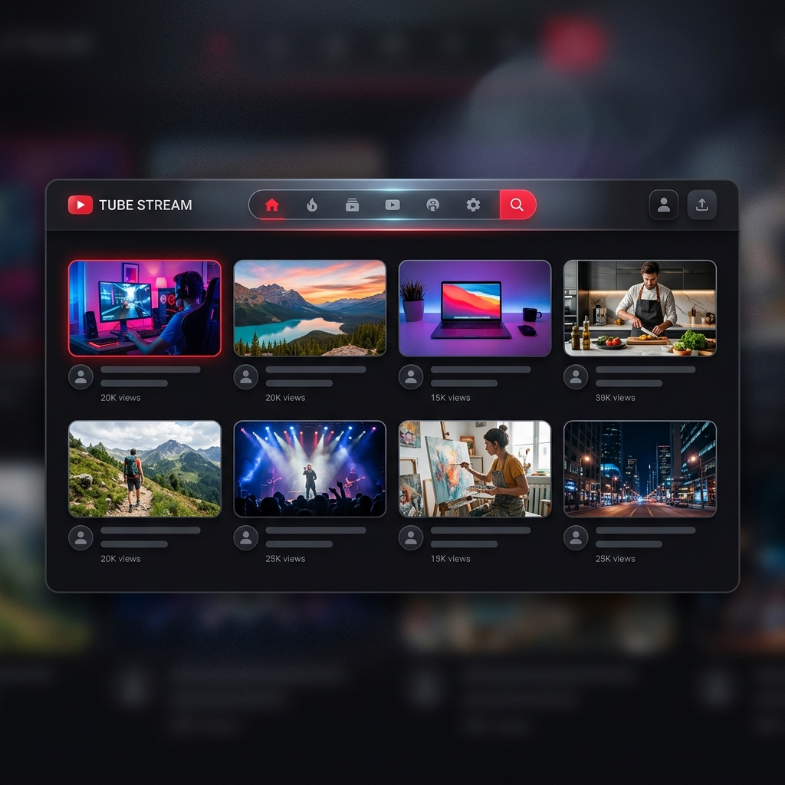

# YouTube Clone - Premium Video Streaming Platform



## 🚀 Overview
A high-performance, aesthetically pleasing YouTube clone built with **React**, **Vite**, and the **YouTube Data API v3**. This project replicates the core features of YouTube, including dynamic video fetching, search functionality, category-based exploration, and a responsive dark-mode interface.

## ✨ Features
- **Dynamic Home Feed**: Fetches trending videos globally using the YouTube API.
- **Advanced Search**: Real-time video search with optimized API calls.
- **Category Explorer**: Dedicated feeds for **Music**, **Gaming**, **Sports**, **Movies**, and **Educational Courses**.
- **Infinite Scrolling**: Seamlessly load more content as you scroll.
- **Interactive Video Player**: Embedded video player with full playback controls.
- **Responsive Design**: Fully optimized for mobile, tablet, and desktop views.
- **Dark Mode UI**: Sleek, modern interface using glassmorphism and premium aesthetics.

## 🛠️ Tech Stack
- **Frontend**: React.js, Vite
- **Styling**: Vanilla CSS (Custom Design System)
- **Icons**: Lucide React
- **API**: YouTube Data API v3
- **Routing**: React Router DOM

## 🚦 Getting Started

### Prerequisites
- Node.js (v16+)
- YouTube API Key (from [Google Cloud Console](https://console.cloud.google.com/))

### Installation
1. **Clone the repository**:
   ```bash
   git clone https://github.com/Vivek-Krishna00/YT-clone.git
   cd YT-clone
   ```

2. **Install dependencies**:
   ```bash
   npm install
   ```

3. **Set up environment variables**:
   Create a `.env` file in the root directory and add your API key:
   ```env
   VITE_YOUTUBE_API_KEY=your_api_key_here
   ```

4. **Run the development server**:
   ```bash
   npm run dev
   ```

## 📂 Project Structure
```text
src/
├── Components/    # Reusable UI components (Navbar, Sidebar, VideoCard, etc.)
├── Pages/         # Page-level components (Home, Search, Gaming, etc.)
├── utils/         # API helpers and custom hooks
├── App.jsx        # Main application routing
└── main.jsx       # Entry point
```

## 🤝 Contributing
Contributions are welcome! Feel free to open an issue or submit a pull request.

## 📄 License
This project is licensed under the MIT License.